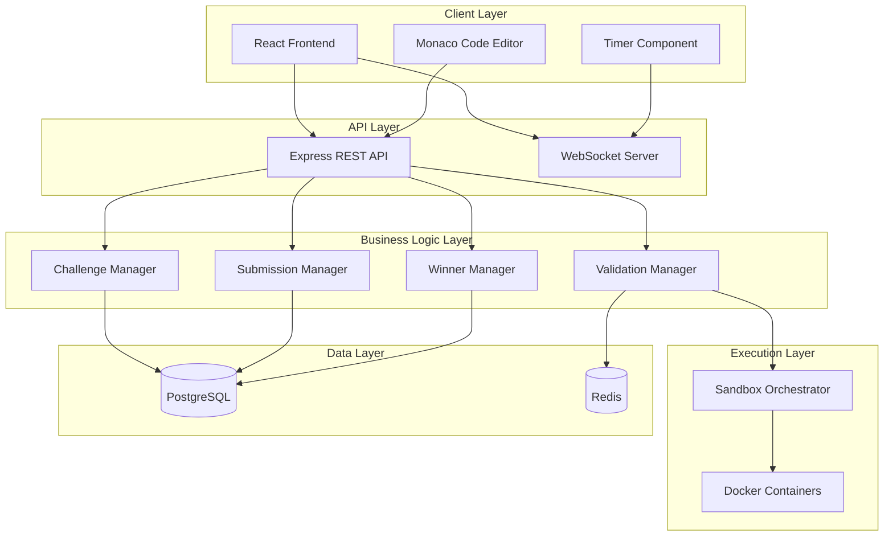

# Design Document: Runtime Rush Platform

## Overview

Runtime Rush is a web-based coding challenge platform built around a competitive debugging and code reconstruction experience. The architecture follows a client-server model with a React-based frontend, Node.js/Express backend, and isolated Docker-based code execution sandbox.

The system handles the complete competition lifecycle: organizers create challenges with fragmented/buggy code, participants reconstruct and debug the code in a browser-based editor, submit solutions that run in isolated sandboxes, and the system automatically validates outputs and declares winners based on timestamp ordering.

Key architectural principles:
- Security-first sandbox isolation for untrusted code execution
- Real-time state synchronization between client and server
- Stateless validation for horizontal scalability
- Immutable submission records for audit trails

## Architecture

### System Components



### Component Responsibilities

**Frontend (React)**
- Renders challenge UI, code editor, timer, and submission interface
- Manages local code editing state with auto-save
- Communicates with backend via REST API and WebSocket
- Displays real-time timer updates and validation feedback

**API Layer (Express)**
- Exposes REST endpoints for challenge CRUD, submissions, validation
- Handles authentication and authorization
- Routes requests to appropriate business logic managers
- WebSocket server pushes timer updates and winner announcements

**Challenge Manager**
- Creates, stores, and retrieves challenge definitions
- Manages code fragments, bugs, test cases
- Validates challenge configuration completeness

**Validation Manager**
- Orchestrates syntax checking and test case execution
- Compares actual vs expected outputs
- Determines submission correctness
- Caches validation results to avoid redundant execution

**Submission Manager**
- Records submissions with server-side timestamps
- Associates submissions with participants and challenges
- Enforces submission rules (challenge active, etc.)
- Provides submission history queries

**Winner Manager**
- Identifies first correct submission by timestamp
- Declares winner atomically (prevents race conditions)
- Maintains winner immutability
- Generates leaderboard of correct submissions

**Sandbox Orchestrator**
- Spawns isolated Docker containers for code execution
- Enforces resource limits (CPU, memory, time, network)
- Captures stdout, stderr, exit codes
- Cleans up containers after execution

**Data Layer**
- PostgreSQL stores challenges, submissions, users, winners
- Redis caches validation results and active session state

## Components and Interfaces

### Challenge Manager

```typescript
interface Challenge {
  id: string;
  title: string;
  description: string;
  language: ProgrammingLanguage;
  fragments: CodeFragment[];
  correctSolution: string;
  testCases: TestCase[];
  startTime: Date;
  endTime: Date;
  createdBy: string;
}

interface CodeFragment {
  id: string;
  content: string;
  order: number; // Original order in correct solution
}

interface TestCase {
  id: string;
  input: string;
  expectedOutput: string;
  visible: boolean; // Whether participants can see this test case
}

enum ProgrammingLanguage {
  PYTHON = "python"
}

class ChallengeManager {
  createChallenge(challenge: Challenge): Promise<Challenge>;
  getChallenge(id: string): Promise<Challenge>;
  updateChallenge(id: string, updates: Partial<Challenge>): Promise<Challenge>;
  deleteChallenge(id: string): Promise<void>;
  listChallenges(): Promise<Challenge[]>;
  validateChallenge(challenge: Challenge): ValidationResult;
}
```

### Validation Manager

```typescript
interface ValidationRequest {
  challengeId: string;
  code: string;
  language: ProgrammingLanguage;
}

interface ValidationResult {
  isValid: boolean;
  syntaxErrors: SyntaxError[];
  testResults: TestResult[];
  allTestsPassed: boolean;
}

interface TestResult {
  testCaseId: string;
  passed: boolean;
  actualOutput: string;
  expectedOutput: string;
  executionTime: number;
  error?: string;
}

interface SyntaxError {
  line: number;
  column: number;
  message: string;
}

class ValidationManager {
  validateSubmission(request: ValidationRequest): Promise<ValidationResult>;
  checkSyntax(code: string, language: ProgrammingLanguage): Promise<SyntaxError[]>;
  runTestCases(code: string, testCases: TestCase[], language: ProgrammingLanguage): Promise<TestResult[]>;
}
```

### Sandbox Orchestrator

```typescript
interface ExecutionRequest {
  code: string;
  language: ProgrammingLanguage;
  input: string;
  timeoutMs: number;
  memoryLimitMb: number;
}

interface ExecutionResult {
  stdout: string;
  stderr: string;
  exitCode: number;
  executionTime: number;
  timedOut: boolean;
  memoryExceeded: boolean;
}

class SandboxOrchestrator {
  execute(request: ExecutionRequest): Promise<ExecutionResult>;
  cleanup(containerId: string): Promise<void>;
}
```

### Submission Manager

```typescript
interface Submission {
  id: string;
  challengeId: string;
  participantId: string;
  code: string;
  timestamp: Date;
  validationResult: ValidationResult;
  isCorrect: boolean;
}

class SubmissionManager {
  submitCode(challengeId: string, participantId: string, code: string): Promise<Submission>;
  getSubmission(id: string): Promise<Submission>;
  getSubmissionsByParticipant(participantId: string, challengeId: string): Promise<Submission[]>;
  getSubmissionsByChallenge(challengeId: string): Promise<Submission[]>;
}
```

### Winner Manager

```typescript
interface Winner {
  challengeId: string;
  participantId: string;
  submissionId: string;
  timestamp: Date;
}

class WinnerManager {
  declareWinner(challengeId: string, submissionId: string): Promise<Winner>;
  getWinner(challengeId: string): Promise<Winner | null>;
  getLeaderboard(challengeId: string): Promise<Submission[]>;
}
```

### Session Manager

```typescript
interface ParticipantSession {
  participantId: string;
  challengeId: string;
  currentCode: string;
  lastSaved: Date;
}

class SessionManager {
  saveSession(session: ParticipantSession): Promise<void>;
  getSession(participantId: string, challengeId: string): Promise<ParticipantSession | null>;
  autoSave(participantId: string, challengeId: string, code: string): Promise<void>;
}
```

## Data Models

### Database Schema

```sql
-- Users table
CREATE TABLE users (
  id UUID PRIMARY KEY DEFAULT gen_random_uuid(),
  username VARCHAR(255) UNIQUE NOT NULL,
  email VARCHAR(255) UNIQUE NOT NULL,
  role VARCHAR(50) NOT NULL, -- 'organizer' or 'participant'
  created_at TIMESTAMP DEFAULT NOW()
);

-- Challenges table
CREATE TABLE challenges (
  id UUID PRIMARY KEY DEFAULT gen_random_uuid(),
  title VARCHAR(255) NOT NULL,
  description TEXT NOT NULL,
  language VARCHAR(50) NOT NULL,
  correct_solution TEXT NOT NULL,
  start_time TIMESTAMP NOT NULL,
  end_time TIMESTAMP NOT NULL,
  created_by UUID REFERENCES users(id),
  created_at TIMESTAMP DEFAULT NOW()
);

-- Code fragments table
CREATE TABLE code_fragments (
  id UUID PRIMARY KEY DEFAULT gen_random_uuid(),
  challenge_id UUID REFERENCES challenges(id) ON DELETE CASCADE,
  content TEXT NOT NULL,
  original_order INTEGER NOT NULL,
  created_at TIMESTAMP DEFAULT NOW()
);

-- Test cases table
CREATE TABLE test_cases (
  id UUID PRIMARY KEY DEFAULT gen_random_uuid(),
  challenge_id UUID REFERENCES challenges(id) ON DELETE CASCADE,
  input TEXT NOT NULL,
  expected_output TEXT NOT NULL,
  visible BOOLEAN DEFAULT true,
  created_at TIMESTAMP DEFAULT NOW()
);

-- Submissions table
CREATE TABLE submissions (
  id UUID PRIMARY KEY DEFAULT gen_random_uuid(),
  challenge_id UUID REFERENCES challenges(id),
  participant_id UUID REFERENCES users(id),
  code TEXT NOT NULL,
  timestamp TIMESTAMP DEFAULT NOW(),
  is_correct BOOLEAN NOT NULL,
  validation_result JSONB NOT NULL
);

-- Winners table
CREATE TABLE winners (
  challenge_id UUID PRIMARY KEY REFERENCES challenges(id),
  participant_id UUID REFERENCES users(id),
  submission_id UUID REFERENCES submissions(id),
  timestamp TIMESTAMP NOT NULL,
  declared_at TIMESTAMP DEFAULT NOW()
);

-- Sessions table (for auto-save)
CREATE TABLE participant_sessions (
  participant_id UUID REFERENCES users(id),
  challenge_id UUID REFERENCES challenges(id),
  current_code TEXT NOT NULL,
  last_saved TIMESTAMP DEFAULT NOW(),
  PRIMARY KEY (participant_id, challenge_id)
);

-- Indexes for performance
CREATE INDEX idx_submissions_challenge ON submissions(challenge_id, timestamp);
CREATE INDEX idx_submissions_participant ON submissions(participant_id, challenge_id);
CREATE INDEX idx_submissions_correct ON submissions(challenge_id, is_correct, timestamp);
```

### Redis Cache Structure

```
# Validation result cache (TTL: 1 hour)
validation:{challengeId}:{codeHash} -> ValidationResult JSON

# Active session cache (TTL: challenge duration)
session:{participantId}:{challengeId} -> ParticipantSession JSON

# Challenge active status (TTL: challenge duration)
challenge:active:{challengeId} -> boolean

# Winner cache (no TTL - permanent)
winner:{challengeId} -> Winner JSON
```

## Correctness Properties

*A property is a characteristic or behavior that should hold true across all valid executions of a system—essentially, a formal statement about what the system should do. Properties serve as the bridge between human-readable specifications and machine-verifiable correctness guarantees.*


### Property 1: Challenge Data Round-Trip Persistence
*For any* valid challenge with title, description, language, code fragments, correct solution, and test cases, creating the challenge and then retrieving it should return an equivalent challenge with all data intact.
**Validates: Requirements 1.1, 1.2, 1.3, 1.5, 2.1**

### Property 2: Challenge Validation Rejects Incomplete Data
*For any* challenge missing required fields (title, description, language, or test cases), attempting to create the challenge should be rejected with a validation error.
**Validates: Requirements 1.6**

### Property 3: Fragment Scrambling
*For any* challenge with multiple code fragments, retrieving the challenge for participants should return fragments in an order different from the original order.
**Validates: Requirements 2.2**

### Property 4: Test Case Input Visibility Filtering
*For any* challenge with test cases, retrieving visible test cases should return inputs but not expected outputs, while hidden test cases should not be returned at all.
**Validates: Requirements 2.5**

### Property 5: Session Code Round-Trip Persistence
*For any* participant session with code content, saving the session and then retrieving it should return the same code content.
**Validates: Requirements 3.4, 10.2**

### Property 6: Code Execution Returns Output
*For any* syntactically valid code that produces output, executing it in the sandbox should return the stdout, stderr, and exit code.
**Validates: Requirements 4.1, 4.6**

### Property 7: File System Access Restriction
*For any* code that attempts to access files outside designated temporary directories, the sandbox should block the access or return an error.
**Validates: Requirements 4.2**

### Property 8: Network Access Restriction
*For any* code that attempts network operations (HTTP requests, socket connections), the sandbox should block the access or return an error.
**Validates: Requirements 4.3**

### Property 9: Syntax Error Detection
*For any* code with syntax errors, the validation system should detect and return syntax error messages with line and column information.
**Validates: Requirements 5.1, 9.4**

### Property 10: Syntax Errors Prevent Test Execution
*For any* code with syntax errors, the validation system should not execute test cases and should return only syntax error information.
**Validates: Requirements 5.2**

### Property 11: All Test Cases Execute
*For any* syntactically valid code and challenge with N test cases, validation should execute all N test cases and return N test results.
**Validates: Requirements 5.3, 11.1**

### Property 12: Output Comparison Correctness
*For any* test case with expected output, if the actual output matches the expected output (ignoring trailing whitespace), the test result should indicate a pass.
**Validates: Requirements 5.4, 5.7**

### Property 13: Submission Correctness Determination
*For any* submission, it should be marked as correct if and only if all test cases pass.
**Validates: Requirements 5.5**

### Property 14: Test Results Include Pass/Fail Status
*For any* test case execution, the result should include a boolean indicating whether the test passed or failed.
**Validates: Requirements 5.6, 11.2**

### Property 15: Submission Round-Trip Persistence
*For any* submission with code, participant ID, and challenge ID, creating the submission should store it with a server timestamp, and retrieving it should return the same code, participant ID, challenge ID, and timestamp.
**Validates: Requirements 6.1, 6.2, 6.3, 6.4**

### Property 16: Multiple Submissions Allowed
*For any* participant and challenge, submitting code multiple times should result in multiple distinct submission records being stored.
**Validates: Requirements 6.5**

### Property 17: Submissions Rejected After Challenge End
*For any* challenge that has ended (current time > end time), attempting to submit code should be rejected with an error.
**Validates: Requirements 6.6**

### Property 18: First Correct Submission Wins
*For any* challenge with multiple correct submissions, the winner should be the submission with the earliest timestamp.
**Validates: Requirements 7.1, 7.2**

### Property 19: Winner Immutability
*For any* challenge with a declared winner, attempting to declare a different winner should fail, and the original winner should remain unchanged.
**Validates: Requirements 7.4**

### Property 20: Leaderboard Chronological Ordering
*For any* challenge with multiple correct submissions, retrieving the leaderboard should return submissions ordered by timestamp (earliest first).
**Validates: Requirements 7.5**

### Property 21: Remaining Time Calculation
*For any* active challenge (start time < current time < end time), calculating remaining time should return end time minus current time.
**Validates: Requirements 8.1**

### Property 22: Challenge Status Transition at End Time
*For any* challenge where current time >= end time, the challenge status should be marked as ended.
**Validates: Requirements 8.3**

### Property 23: Time Until Start Calculation
*For any* challenge that has not started (current time < start time), calculating time until start should return start time minus current time.
**Validates: Requirements 8.5**

### Property 24: Session Isolation
*For any* two different participants or two different challenges, saving code in one session should not affect the code in another session.
**Validates: Requirements 10.3**

### Property 25: Session Persistence After Challenge End
*For any* participant session, the code should remain retrievable even after the challenge end time has passed.
**Validates: Requirements 10.4**

### Property 26: Unlimited Test Executions
*For any* active challenge, executing test cases multiple times (e.g., 100 times) should succeed without rate limiting errors.
**Validates: Requirements 11.5**

### Property 27: Environment Variable Isolation
*For any* code that attempts to read environment variables, the sandbox should either block access or return only non-sensitive variables.
**Validates: Requirements 12.1**

### Property 28: Process Spawning Prevention
*For any* code that attempts to spawn child processes, the sandbox should block the operation or return an error.
**Validates: Requirements 12.2**

### Property 29: System Modification Prevention
*For any* code that attempts system-modifying operations (e.g., changing system time, modifying kernel parameters), the sandbox should block the operation.
**Validates: Requirements 12.3**

### Property 30: Malicious Code Termination
*For any* code exhibiting malicious patterns (e.g., fork bombs, infinite resource allocation), the sandbox should terminate execution before resource exhaustion.
**Validates: Requirements 12.4**

### Property 31: Execution Audit Logging
*For any* code execution request, the system should create a log entry containing the participant ID, challenge ID, timestamp, and execution result.
**Validates: Requirements 12.5**

## Error Handling

### Validation Errors
- **Invalid Challenge Data**: Return 400 Bad Request with specific field errors
- **Missing Required Fields**: Return 400 Bad Request listing missing fields
- **Invalid Time Range**: Return 400 Bad Request if start time >= end time

### Execution Errors
- **Timeout**: Return ExecutionResult with `timedOut: true` and partial output
- **Memory Exceeded**: Return ExecutionResult with `memoryExceeded: true` and error message
- **Syntax Errors**: Return ValidationResult with syntax errors, do not execute code
- **Runtime Errors**: Capture stderr and exit code, return in ExecutionResult

### Submission Errors
- **Challenge Not Found**: Return 404 Not Found
- **Challenge Not Active**: Return 403 Forbidden with message "Challenge has not started" or "Challenge has ended"
- **Unauthorized**: Return 401 Unauthorized if participant is not authenticated

### Sandbox Errors
- **Container Spawn Failure**: Retry up to 3 times, then return 503 Service Unavailable
- **Container Cleanup Failure**: Log error but do not fail the request
- **Security Violation**: Terminate execution immediately, log incident, return error to user

### Database Errors
- **Connection Failure**: Retry with exponential backoff, return 503 if all retries fail
- **Constraint Violation**: Return 409 Conflict for duplicate submissions or winner conflicts
- **Transaction Failure**: Rollback and return 500 Internal Server Error

### Race Condition Handling
- **Winner Declaration**: Use database transaction with SELECT FOR UPDATE to ensure atomic winner declaration
- **Concurrent Submissions**: Allow concurrent submissions, use timestamp ordering for winner determination
- **Session Auto-Save**: Use upsert (INSERT ON CONFLICT UPDATE) to handle concurrent saves

## Testing Strategy

### Dual Testing Approach

The testing strategy employs both unit tests and property-based tests to ensure comprehensive coverage:

- **Unit tests** verify specific examples, edge cases, and error conditions
- **Property-based tests** verify universal properties across all inputs through randomized testing
- Both approaches are complementary and necessary for comprehensive correctness validation

### Property-Based Testing

**Framework**: Use `fast-check` for JavaScript/TypeScript property-based testing

**Configuration**:
- Minimum 100 iterations per property test (due to randomization)
- Each property test must reference its design document property
- Tag format: `// Feature: runtime-rush-platform, Property {number}: {property_text}`

**Property Test Implementation**:
- Each correctness property listed above must be implemented as a single property-based test
- Tests should generate random valid inputs (challenges, code, submissions, etc.)
- Tests should verify the property holds for all generated inputs
- Tests should use appropriate generators for domain objects (UUIDs, timestamps, code strings, etc.)

**Example Property Test Structure**:
```typescript
// Feature: runtime-rush-platform, Property 1: Challenge Data Round-Trip Persistence
test('challenge data persists correctly through create and retrieve', async () => {
  await fc.assert(
    fc.asyncProperty(
      challengeArbitrary(), // Generator for random valid challenges
      async (challenge) => {
        const created = await challengeManager.createChallenge(challenge);
        const retrieved = await challengeManager.getChallenge(created.id);
        
        expect(retrieved.title).toBe(challenge.title);
        expect(retrieved.description).toBe(challenge.description);
        expect(retrieved.fragments).toHaveLength(challenge.fragments.length);
        expect(retrieved.testCases).toHaveLength(challenge.testCases.length);
      }
    ),
    { numRuns: 100 }
  );
});
```

### Unit Testing

**Framework**: Use Jest for JavaScript/TypeScript unit testing

**Focus Areas**:
- Specific examples demonstrating correct behavior
- Edge cases: empty inputs, boundary values, special characters
- Error conditions: invalid inputs, missing data, constraint violations
- Integration points: API endpoints, database operations, sandbox communication

**Unit Test Balance**:
- Avoid writing too many unit tests for scenarios covered by property tests
- Focus unit tests on concrete examples that illustrate specific behaviors
- Use unit tests for integration testing between components
- Property tests handle comprehensive input coverage through randomization

**Example Unit Test Structure**:
```typescript
describe('ChallengeManager', () => {
  test('rejects challenge with missing title', async () => {
    const invalidChallenge = { description: 'Test', language: 'python' };
    await expect(challengeManager.createChallenge(invalidChallenge))
      .rejects.toThrow('Title is required');
  });
  
  test('timeout example: code running 15 seconds times out', async () => {
    const longRunningCode = 'import time\ntime.sleep(15)';
    const result = await sandbox.execute({
      code: longRunningCode,
      language: 'python',
      input: '',
      timeoutMs: 10000,
      memoryLimitMb: 256
    });
    expect(result.timedOut).toBe(true);
  });
});
```

### Integration Testing

**API Endpoint Tests**:
- Test complete request/response cycles
- Verify authentication and authorization
- Test error responses and status codes
- Verify WebSocket message delivery

**Database Integration Tests**:
- Test transaction handling and rollback
- Verify constraint enforcement
- Test concurrent access scenarios
- Verify index usage for performance

**Sandbox Integration Tests**:
- Test Docker container lifecycle
- Verify resource limit enforcement
- Test cleanup after execution
- Verify security isolation

### Security Testing

**Sandbox Security Tests**:
- Attempt file system access outside allowed directories
- Attempt network connections
- Attempt process spawning
- Attempt environment variable access
- Test resource exhaustion scenarios (fork bombs, memory allocation)

**API Security Tests**:
- Test authentication bypass attempts
- Test authorization for different user roles
- Test SQL injection prevention
- Test XSS prevention in code display

### Performance Testing

**Load Testing**:
- Simulate multiple concurrent participants
- Test submission throughput
- Test sandbox container pool management
- Verify database query performance under load

**Stress Testing**:
- Test system behavior at capacity limits
- Test graceful degradation
- Test recovery after failures
- Verify resource cleanup under stress
